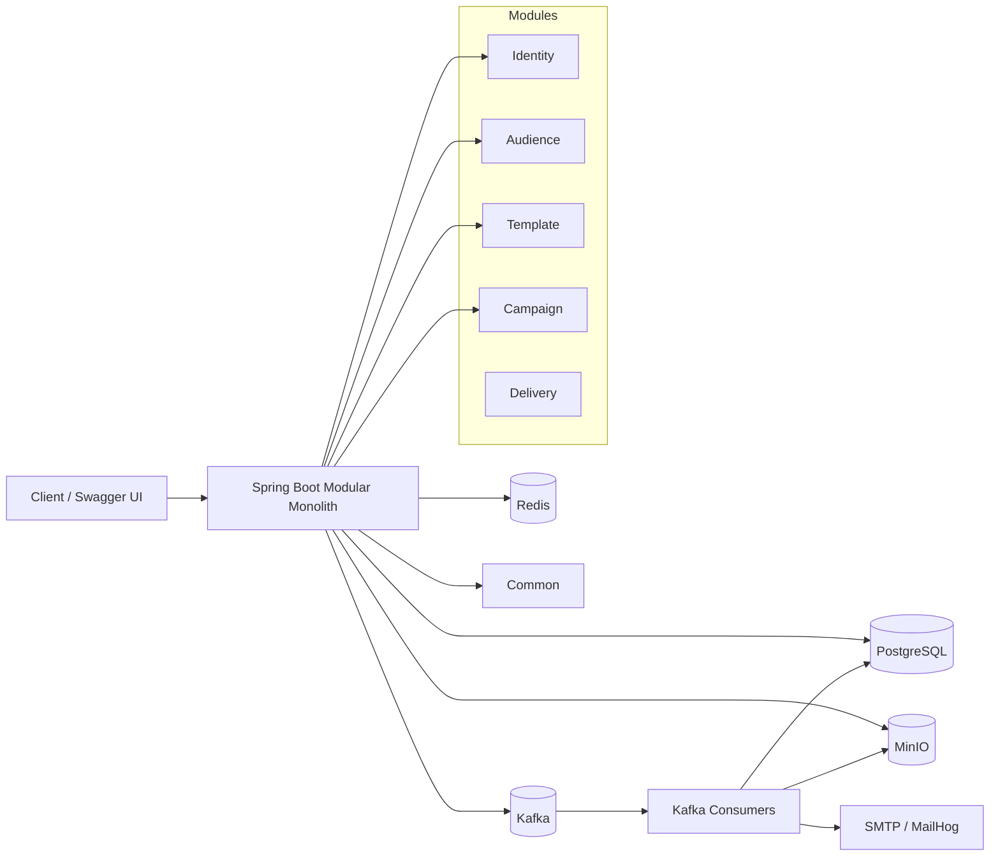
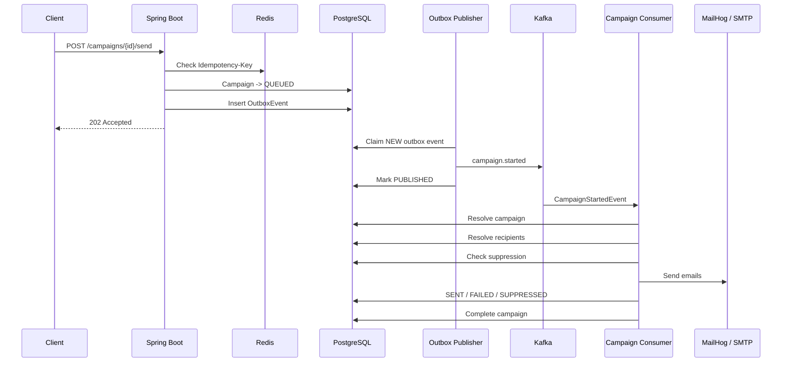

# CampaignFlow

CampaignFlow is a multi-tenant SaaS email campaign platform built with Spring Boot.

The project focuses on production-oriented backend patterns such as **tenant isolation, transactional outbox, Kafka-based asynchronous processing, retry/DLT handling, Redis idempotency, caching, rate limiting, distributed locking, and object storage with MinIO**.

The MVP supports tenant/user management, contact management, CSV contact imports, email templates, campaign creation, asynchronous campaign triggering, email delivery, suppression handling, and campaign statistics.

---

## Tech Stack

### Backend
- Java 21
- Spring Boot
- Spring Security
- Spring Data JPA
- Spring Kafka
- Spring Data Redis
- Spring Mail
- Springdoc OpenAPI / Swagger UI

### Infrastructure
- PostgreSQL
- Apache Kafka
- Redis
- MinIO
- MailHog
- Docker / Docker Compose

---

## Core Features

### Identity & Multi-Tenancy
- Tenant onboarding
- User authentication
- JWT access and refresh tokens
- Tenant-aware request context
- Strict tenant data isolation
- User management and authorization

### Audience Management
- Contact CRUD
- Tags and contact-tag mapping
- Segments
- Suppression list
- CSV contact import
- Import progress tracking
- Duplicate contact protection

### Async CSV Import

1. User uploads a CSV file.
2. File is stored in MinIO.
3. `ContactImport` metadata and an `OutboxEvent` are persisted.
4. Outbox publisher publishes `contact.import.requested` to Kafka.
5. Kafka consumer streams the CSV from MinIO.
6. Contacts are processed in batches.
7. Import status is updated to `COMPLETED`, `PARTIALLY_COMPLETED`, or `FAILED`.

### Email Templates
- Create email templates
- Update/archive templates
- HTML email content
- Subject configuration
- Basic placeholders:
  - `{{fullName}}`
  - `{{email}}`

### Campaigns
- Create campaign
- Select template
- Send campaign
- Redis-based send idempotency
- Transactional outbox
- Kafka-based asynchronous campaign trigger
- Suppression filtering
- Recipient-level status tracking
- SMTP email delivery
- Basic campaign statistics

---

## Architecture



---

## Main Campaign Flow



---

## Reliability Patterns

### Transactional Outbox

Business state and outbox events are saved in the same PostgreSQL transaction.

Example:

```text
Campaign -> QUEUED
+
OutboxEvent -> NEW
```

The outbox publisher later publishes the event to Kafka and changes the outbox status to `PUBLISHED`.

This avoids the dual-write problem where the database commit succeeds but Kafka publishing fails.

### Kafka Retry and DLT

Kafka consumers use a shared `DefaultErrorHandler`.

Retryable failures are retried using a configured backoff.

After retries are exhausted, the record is published to:

```text
<original-topic>.DLT
```

Examples:

```text
contact.import.requested.DLT
campaign.started.DLT
```

Domain errors that cannot succeed after retry can extend the application's `NonRetryableKafkaException`.

### Idempotency

Campaign send requests require:

```http
Idempotency-Key: <unique-key>
```

Redis prevents duplicate campaign execution.

Database constraints such as:

```text
UNIQUE(campaign_id, contact_id)
```

provide another idempotency layer during Kafka processing.

### Caching

Redis can cache frequently-read resources such as:

```text
email-template:{tenantId}:{templateId}
```

Invalidate template cache on update/archive.

### Rate Limiting

Redis is used for tenant-aware email rate limiting.

Example:

```text
email-rate:{tenantId}:{epochSecond}
```

### Distributed Locking

Redis locking can be used around campaign processing to prevent multiple application instances from processing the same campaign simultaneously.

Example:

```text
lock:campaign:{campaignId}
```

Use a unique lock token and validate the token during unlock.

---

## Modules

```text
campaignflow
├── identity
│   ├── tenant
│   ├── user
│   ├── auth
│   └── context
│
├── audience
│   ├── contact
│   ├── tag
│   ├── segment
│   ├── suppression
│   ├── imports
│   └── api
│
├── template
│   └── EmailTemplate
│
├── campaign
│   ├── Campaign
│   ├── CampaignRecipient
│   ├── CampaignConsumer
│   └── CampaignProcessor
│
├── delivery
│   ├── EmailProvider
│   └── SmtpEmailProvider
│
└── infrastructure
    ├── kafka
    ├── outbox
    ├── redis
    └── storage
```

---

## Important Entities

### Identity
- `Tenant`
- `User`
- Refresh token / authentication entities

### Audience
- `Contact`
- `Tag`
- `ContactTag`
- `Segment`
- `SuppressionEntry`
- `ContactImport`

### Template
- `EmailTemplate`

### Campaign
- `Campaign`
- `CampaignRecipient`

### Infrastructure
- `OutboxEvent`

---

## Campaign States

```text
DRAFT
  |
  v
QUEUED
  |
  v
PROCESSING
  |
  +----> COMPLETED
  |
  +----> PARTIALLY_FAILED
  |
  +----> FAILED
```

---

## Contact Import States

```text
PENDING
   |
   v
PROCESSING
   |
   +----> COMPLETED
   |
   +----> PARTIALLY_COMPLETED
   |
   +----> FAILED
```

---

## Local Infrastructure

| Service | Purpose | Typical Host Port |
|---|---|---:|
| Spring Boot | Application API | 8080 |
| PostgreSQL | Primary database | 5433 |
| Redis | Cache, idempotency, rate limiting, locks | 6379 |
| Kafka | Event streaming | 29092 |
| MinIO API | CSV/object storage | 9000 |
| MinIO Console | Object-storage UI | 9001 |
| MailHog SMTP | Local email server | 1025 |
| MailHog UI | Inspect received emails | 8025 |

Adjust ports to match your `docker-compose.yml` and `application.yml`.

---

## Environment Variables

Example `.env`:

```env
DB_URL=jdbc:postgresql://localhost:5433/campaignflow
DB_USERNAME=campaignflow
DB_PASSWORD=campaignflow

KAFKA_BROKERS=localhost:29092

REDIS_HOST=localhost
REDIS_PORT=6379

MINIO_ENDPOINT=http://localhost:9000
MINIO_ACCESS_KEY=minioadmin
MINIO_SECRET_KEY=minioadmin
MINIO_BUCKET=campaign-flow

MAIL_HOST=localhost
MAIL_PORT=1025
MAIL_FROM=no-reply@campaignflow.local

JWT_SECRET=replace-me
```

Do not commit real credentials or production secrets.

---

## Run Locally

### Start infrastructure

```bash
docker compose up -d
```

### Start Spring Boot

```bash
./mvnw spring-boot:run
```

or:

```bash
mvn spring-boot:run
```

### Verify application health

```text
GET /actuator/health
```

---

## Swagger / OpenAPI

Swagger UI:

```text
http://localhost:8080/swagger-ui.html
```

OpenAPI JSON:

```text
http://localhost:8080/v3/api-docs
```

OpenAPI YAML:

```text
http://localhost:8080/v3/api-docs.yaml
```

Use the **Authorize** button in Swagger UI and provide the JWT access token.

---

## Primary API Endpoints

### Authentication / Tenant

```text
POST  /api/v1/auth/login
POST  /api/v1/auth/refresh
POST  /api/v1/auth/logout

GET   /api/v1/tenants/current
PATCH /api/v1/tenants/current
```

### Contacts

```text
POST   /api/v1/contacts
GET    /api/v1/contacts
GET    /api/v1/contacts/{contactId}
PATCH  /api/v1/contacts/{contactId}
DELETE /api/v1/contacts/{contactId}
```

### Contact Import

```text
POST /api/v1/contact-imports
GET  /api/v1/contact-imports
GET  /api/v1/contact-imports/{importId}
```

### Suppression

```text
POST   /api/v1/suppressions
GET    /api/v1/suppressions
DELETE /api/v1/suppressions/{suppressionId}
```

### Templates

```text
POST   /api/v1/templates
GET    /api/v1/templates
GET    /api/v1/templates/{templateId}
PATCH  /api/v1/templates/{templateId}
DELETE /api/v1/templates/{templateId}
```

### Campaigns

```text
POST /api/v1/campaigns
GET  /api/v1/campaigns
GET  /api/v1/campaigns/{campaignId}

POST /api/v1/campaigns/{campaignId}/send
GET  /api/v1/campaigns/{campaignId}/stats
```

Campaign send requires:

```http
Idempotency-Key: <unique-key>
```

---

## Sample CSV

```csv
email,firstName,lastName
john@example.com,John,Doe
alice@example.com,Alice,Smith
bob@example.com,Bob,Jones
```

Import flow:

```text
CSV
 -> MinIO
 -> ContactImport + Outbox
 -> Kafka
 -> Import Consumer
 -> Batch Processing
 -> PostgreSQL Contacts
```

---

## Example Template

```json
{
  "name": "Welcome Template",
  "subject": "Welcome to CampaignFlow",
  "htmlContent": "<h2>Hello {{firstName}}</h2><p>Welcome to our campaign.</p>"
}
```

---

## Example Campaign

```json
{
  "name": "Welcome Campaign",
  "templateId": "EMAIL_TEMPLATE_UUID"
}
```

Send:

```http
POST /api/v1/campaigns/CAMPAIGN_UUID/send
Authorization: Bearer <JWT>
Idempotency-Key: demo-001
```

---

## Campaign Statistics

```text
GET /api/v1/campaigns/{campaignId}/stats
```

Example:

```json
{
  "campaignId": "CAMPAIGN_UUID",
  "status": "COMPLETED",
  "totalRecipients": 100,
  "pending": 0,
  "sent": 95,
  "failed": 2,
  "suppressed": 3
}
```

---

## MailHog

MailHog is used as the local SMTP server during development.

```yaml
spring:
  mail:
    host: localhost
    port: 1025
```

Web UI:

```text
http://localhost:8025
```

---

## MinIO

MinIO stores uploaded CSV contact files.

Example object structure:

```text
campaign-flow/
└── contact-imports/
    └── {tenantId}/
        └── {importId}/
            └── contacts.csv
```

The Kafka event contains the import identifier rather than CSV bytes. The consumer reads `bucketName` and `objectKey` from PostgreSQL and streams the file from MinIO.

---

## Kafka Topics

Core topics:

```text
contact.import.requested
campaign.started
```

Dead-letter topics:

```text
contact.import.requested.DLT
campaign.started.DLT
```

Kafka delivery is treated as at-least-once, so consumers must be idempotent.

---

## Outbox States

```text
NEW
PROCESSING
PUBLISHED
FAILED
DEAD
```

Multiple application instances can safely claim different outbox records using PostgreSQL row locking / `SKIP LOCKED`.

---

## MVP Demo Flow

Recommended 2-5 minute demo:

1. Login as tenant admin.
2. Upload `contacts.csv`.
3. Show the CSV object in MinIO.
4. Show import status moving to `COMPLETED`.
5. Show imported contacts.
6. Create an email template.
7. Create a campaign.
8. Send campaign with `Idempotency-Key`.
9. Show the campaign outbox event.
10. Show Kafka consumer processing logs.
11. Show generated emails in MailHog.
12. Retry the same send request and show it is not duplicated.
13. Show campaign statistics.
14. Optionally demonstrate Kafka retry/DLT.

---

## Production-Oriented Decisions

### Why a Modular Monolith?
- simpler deployment
- ACID transactions within PostgreSQL
- clear module boundaries
- faster hackathon delivery
- fewer distributed-system failure modes
- modules can be extracted later if required

### Why PostgreSQL?
Source of truth for tenant-owned business entities and outbox events.

### Why Redis?
Used for:
- idempotency
- caching
- rate limiting
- distributed locking

### Why Kafka?
Used for:
- asynchronous CSV import
- asynchronous campaign execution
- retry and DLT handling

### Why MinIO?
CSV files belong in object storage rather than the relational database.

### Why MailHog?
Provides a safe local SMTP target and UI for development/demo emails.

---

## Pending / Future Enhancements

Outside MVP scope:

- scheduled campaigns
- campaign segment targeting
- open tracking
- click tracking
- provider webhooks
- bounce/complaint callbacks
- A/B testing
- drip/automation workflows
- billing/subscription plans
- advanced analytics
- multiple email providers
- frontend dashboard

